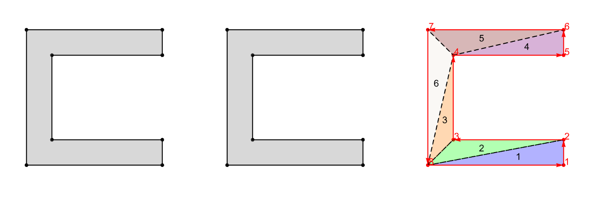
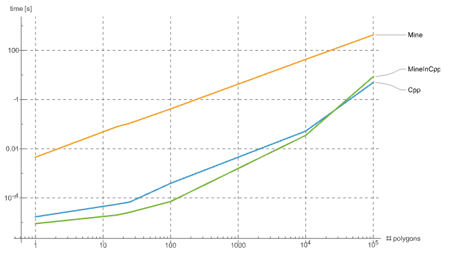

# Earcut++

A C++ library to triangulate polygons, that actually works.

This C++ library implements the **Ear Clipping algorithm** for polygon triangulation. It's designed to be lightweight and performant, able to easly deal with concave polygons.



This library is part of a broader framework focused on polygon splitting and triangulation, designed to support advanced mesh generation for numerical methods. It has been applied in two distinct areas:
– [AR-for-beams](https://multi2mech.github.io/AR-simply-supported-beam-edu/documentation/index.html), a project using augmented reality and structural mechanics to visualize in real time physical beam deformation and stress state.
– [xx-VEM](), for scientific computing with the Virtual Element Method.


## 📦 Structure

- `include/` — Public headers
- `src/` — Implementation files
- `test/` — (Optional) Tests and benchmarks

## 🛠️ Build

```bash
make
```

Or use your own build system, just include the headers and link the sources.

### ⚙️ Integration with Wolfram Mathematica

```bash
make wolfram WOLFRAM_KERNEL_INCLUDE=<path-to-Mathematica>/Contents/SystemFiles/IncludeFiles/C
```

Repalce the `<path-to-Mathematica>` placeholder with your path, for instance on MacOS generally it is: `/Applications/Wolfram.app/`

Then you need create the library link between `build/Triangulate.dylib` and Mathematica:

```mathematica
libpath = FileNameJoin[{<path-to-Earcut>, "build/Triangulate.dylib"}];
lib = LibraryFunctionLoad[libpath, "TriangulateEarClipping", {{Real, 2}, {Integer, 1}}, {Integer, 2}]
```

and so you can call it directly with:

```mathematica
pts = {{0, 0}, {1, 0}, {1, 1}, {0, 1}};
conn = {1, 2, 3, 4};
tri = lib[pts, conn]
```

See [test.nb](test/test_main.nb)

## 📄 Example Usage

```cpp
#include "EarClippingCore.h"
#include "Geometry.h"

int main() {
    Polygon poly = {/* your points here */};
    std::vector<Triangle> result = EarClipping::triangulate(poly);
    return 0;
}
```

or 

## 📈 Computational cost

Easily benchmark it with:

```bash
make benchmark
./build/benchmark > benchmark.csv
```




> The *Earcut++* library is marked as `MineCpp`, the same logic implemented in Mathematica is `Mine` while `Cpp` referer to [`poly2tri`](https://github.com/jhasse/poly2tri).
